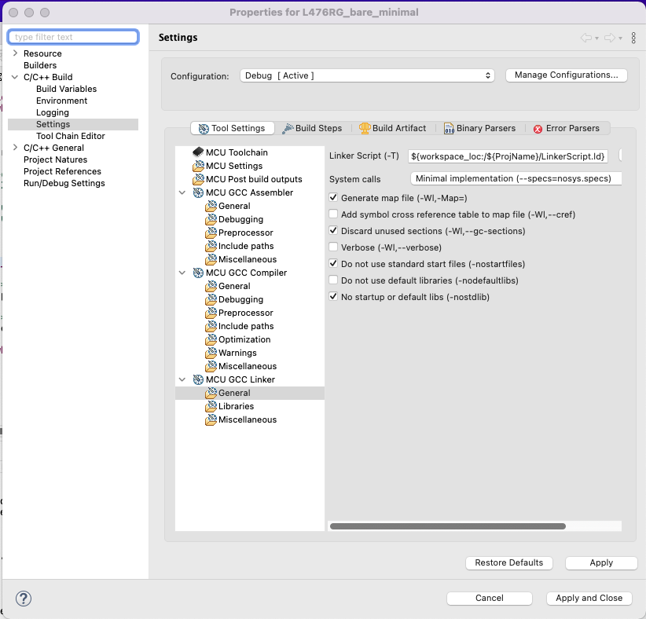

# Button and LED the hard way

In the project we will see the minimal code needed to switch on/off the user LED on the Nucleo-L476RG board when the user button *(blue button)* is pressed/released.

## Find where the LED is connected
According to the [Nucleo user manual](../Docs/nucleo64-user_manual.pdf), the user LED is connected to port A pin 5.

## How to get to port A
First we check the memory mapping from the [datasheet](../Docs/datasheet.pdf) (pages 107 -108).  
We can see that peripherals start at 0x40000000 with GPIOA on bus AHB2 at addresses 0x48000000 - 0x480003FF. That is, AHB2 starts at offset 0x8000000 of the peripheral base (0x40000000), and, GPIOA base starts at offset 0x0 from AHB2 base.

## Find where the Button is connected
According to the [Nucleo user manual](../Docs/nucleo64-user_manual.pdf), the user button is connected to port C pin 13  
(B1 USER: the user button is connected to the I/O PC13 of the microcontroller).

## How to get to port C
From page 107 of the [datasheet](../Docs/datasheet.pdf) we can see that GPIOC is on bus AHB2 at addresses 0x48000800 - 0x48000BFF.  
That is, the base for GPIOC registers is at offset 0x0800 of the AHB2 base.

## GPIO registers
At page 303 of the [reference manual](../Docs/reference_manual.pdf), one can see that GPIOx_MODER is at offset 0x00 of GPIOx base.  

### Set port A pin 5 as output
    Since the reset value for port A is 0xABFFFFFF and the port configuration I/O pin tells us that "11" means "Analog mode" then after reset PA5 is in analog mode. To set it to output mode we must set bit 10 to 1 and bit 11 to 0. Hence, all we have to do is to xor the current value of the register with 0x800 (this will set bit 11 to 0).

### Set port C pin 13 as input
    To set pin 13 as input, one must set bits 26 and 27 at 0.

### Read from / Write to GPIO
At page 306 of the [reference manual](../Docs/reference_manual.pdf), one can see that:
* GPIOx_IDR is at offset 0x10.
* GPIOx_ODR is at offset 0x14. Then set/reset of pin 5 is done with bit 5 (OD5).

## Where is RCC
As can be seen page 79 of the [reference manual](../Docs/reference_manual.pdf), RCC is on AHB1 with addresses 0x40021000 - 0x400213FF.

## Clock gating for for GPIOA and GPIOC.
RCC register map is detailled from page 223 to 282 of the [reference manual](../Docs/reference_manual.pdf).  
RCC_AHB2ENR is at offset 0x4C, bit 0 is for GPIOAEN and bit 2 is for GPIOCEN (see page 255 of the [reference manual](../Docs/reference_manual.pdf)).

## Linker script
The linker script is kept to the minimum since all we need is the code section in flash memory and the stack in RAM.

> Note: the linker script is named "LinkerScript.ld" since it is the name expected by STM32CubeIDE. If you rename it then do not forget to change the path in STM32CubeIDE.

## Reset Handler
The reset handler only contains the code for reading the button state and turning on/off the LED.

## Compiling and flashing the board
For the moment the compilation is done in STM32CubeIDE (*using gcc*) and flashing the board is also done with STM32CubeIDE.

> Note: when creating the project in STM32CubeIDE for the build make sure to not include the standard start files.  
