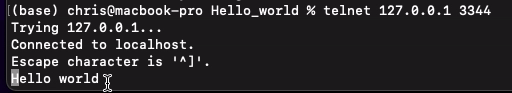

# Hello world
In this project we will see how to use the **Serial Wire Output** (SWO) signal of the ARM **Serial Wire Debug** (SWD) interface to print messages using [OpenOCD](https://openocd.org) and GDB.

## How to build
```bash
make clean
make
```

## How to flash
Connect the board to the PC.
1. Start [OpenOCD](https://openocd.org) using the configuration file `debug.cfg` in one terminal in the `Hello_world` directory.
    ```bash
    openocd -f debug.cgf
    ```

2. In another terminal start the GDB client in the `Hello_world` directory.
    ```bash
    arm-none-eabi-gdb
    ```
    Connect to the gdbserver on the localhost using port 3333 *(as defined in the `debug.cfg` file)*.
    ```bash
    (gdb) target extended-remote :3333
    ```
    Load the software.
    ```bash
    (gdb) load main.elf
    ```
3. In another terminal connect to the gdbserver on the localhost using port 3344 *(as defined in the `debug.cfg` file)*.
    ```bash
    telnet 127.0.0.1 3344
    ```
4. Go back in GDB client's terminal and enter the command to continue.
    ```bash
    (gdb) c
    ```
5. In the terminal connected to port 3344 you should see the messages "Hello world" and "Bye world" alterning.  
